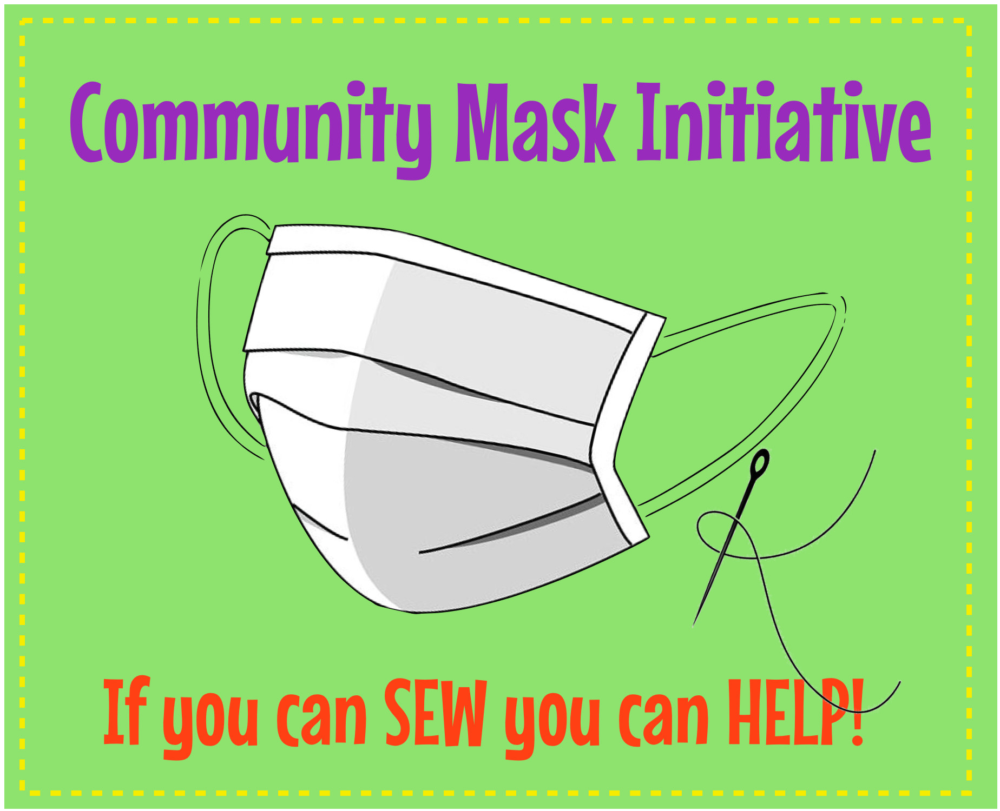

## Community Mask Initiative

#SEW...WE NEED YOUR HELP!
If you can sew, we need your help! Disposable face masks are in short supply and fabric masks can help our healthcare workers and senior citizens. There are many designs online but simple is best. The instructions below for a simple mask can be adapted depending on what you have available. Tightly woven cotton fabric is best. If you don't have flannel for the lining, use two layers of cotton fabric. If you don't have elastic, use bias tape or fabric to edge the short end of the mask and make 10-12" ties on each corner.
Here is a picture tutorial set of instructions:

https://buttoncounter.com/2018/01/14/facemask-a-picture-tutorial/

A collection box has been placed in the vestibule of the Oak Lawn Village Hall by the police desk on the west side of the building. The address of the Village Hall is:
9446 Raymond Avenue
Oak Lawn, IL 60453

Please put your completed masks in a plastic bag and drop them in the box. They will be distributed as needed to local health care providers, nursing homes, etc.

For any questions please email community.mask.initiative@gmail.com

Dig into your fabric stash and be creative! Happy sewing!

Since many stores will be mandatory closed, fabric can be purchased at Walmart, Amazon or mail order from Joann Fabrics