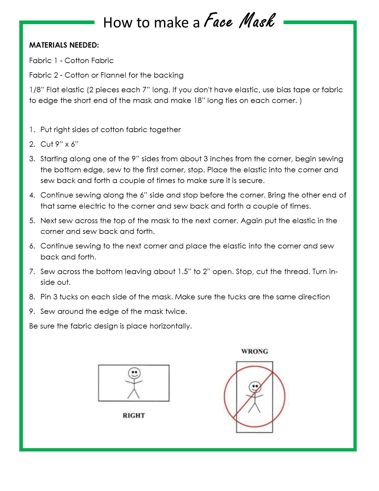

# How to make a mask

Our recommended instructions are below.  Tightly woven cotton fabric is best.  If you don't have flannel for the lining, use two layers of cotton fabric. If you don't have elastic, use bias tape or fabric to edge the short end of the mask and make 10-12" ties on each corner.

## Mask Instructions

## Video Tutorial

